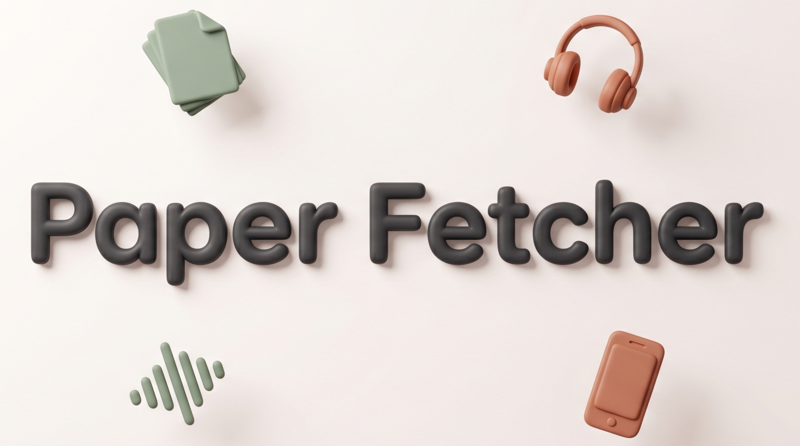

# PaperFetcher

> Every morning, a fresh AI / robotics paper from arXiv lands on your phone as a 10-minute podcast.

Reading the latest research is hard to fit into a busy week. PaperFetcher does
it for you while you sleep: it scans the day's arXiv submissions in AI,
machine learning, robotics, computer vision, and NLP, picks the single paper
most aligned with your research interests, has Claude write a conversation
between two co-hosts about it, synthesizes the audio with two distinct voices,
and drops the episode in your Google Drive folder. By the time you wake up,
it's on your phone — ready for the morning commute.

## What you get each day

In a folder named like `2026-05-12/`, locally and synced to your Drive:

| File | What it is |
|---|---|
| **`digest.mp3`** | The episode itself — ~10 minutes, two voices, conversational |
| **`digest.md`** | A written one-paragraph summary, if you'd rather read |
| **`outline.md`** | A structured "cheat sheet" of the paper's key ideas |
| **`paper.pdf`** | The original arXiv PDF, in case you want to dig deeper |

## Before you install

You'll need:

- **A machine running Ubuntu or Debian.** Any modern architecture works
  (`x86_64`, `arm64`, `armv7`) — Raspberry Pi 4 / 5 and ARM cloud VMs
  (Oracle Cloud Ampere, AWS Graviton, etc.) are fine.
- **`sudo` access** on first install — for the apt packages, the systemd
  timer, and the optional `loginctl enable-linger` step.
- **[Claude Code CLI](https://code.claude.com/docs)**, installed *and*
  authenticated. After installing, run `claude login` and sign in with a
  **Max-plan** account (the pipeline calls Claude several times per run;
  Max keeps it free under your subscription). The installer aborts up front
  if `claude` isn't on `PATH` or `claude auth status` reports you're not
  logged in.
- **A Google account** for Google Drive — the wizard launches
  `rclone config` for the OAuth.
- **(Optional) An [ElevenLabs](https://elevenlabs.io) Creator subscription**
  for premium voices. The free Edge TTS option works fine and you can
  switch later. If you go with ElevenLabs, export your API key in the same
  terminal **before** running the installer:

  ```bash
  export ELEVENLABS_API_KEY=sk_xxxxxxxxxxxxxxxxxxxxxxxx
  ```

  (Add it to `~/.bashrc` or `~/.zshrc` to keep it across shells.)

## Install

One command:

```bash
wget -qO- https://raw.githubusercontent.com/LucaFrat/PaperFetcher/main/install.sh | bash
```

The installer takes about 10 minutes — most of that is the Google Drive
browser auth — and walks you through a setup wizard:

1. **Episode length** — anywhere from 5 to 15 minutes.
2. **Voices** — free Edge TTS voices, or your two ElevenLabs voice IDs.
3. **Schedule** — which days (weekdays only or every day) and what time
   the pipeline should run.
4. **Google Drive** — launches `rclone config` if you haven't set up a
   remote yet.
5. **Research interests** — an interactive **Claude Code chat** opens to
   help you describe what you actually work on. Claude asks focused
   questions, shows you drafts in markdown as you go, and writes
   `config/interests.md` once you confirm. Type `/exit` when done.

When the chat ends, the pipeline is armed and will fire automatically on
your chosen schedule.

## After install

**Force a test run right now:**

```bash
systemctl --user start paperfatcher.service
```

**Watch it live:**

```bash
journalctl --user -u paperfatcher.service -f
```

**When does the next run happen?**

```bash
systemctl --user list-timers paperfatcher.timer
```

## What if my laptop is off at the scheduled time?

The systemd timer is created with `Persistent=true`, which means: if your
machine was powered off (or asleep, or hibernating) when the timer should
have fired, the missed run executes the next time you boot. So if you shut
your laptop at night and turn it on at 9 AM, the missed 05:30 run fires
within a minute of login — the digest lands roughly 5–7 minutes later.

For most laptop users this is fine: the podcast is "ready when I open my
laptop in the morning" rather than "ready at exactly 05:30". A few caveats:

- **Don't forget linger.** Without `sudo loginctl enable-linger "$USER"`
  (which the wizard offers to run), user-level timers pause whenever you
  log out — including the brief "logged out" window between boot and your
  desktop session starting. The wizard sets this up; verify with
  `loginctl show-user "$USER" | grep Linger`.
- **If your laptop stays off for days**, only the most recent missed run is
  caught up — older missed runs are skipped (which is what you want; you
  don't want a 3-paper backlog on Monday).

### Want the podcast ready at the exact scheduled time?

Run PaperFetcher on an always-on machine instead of your laptop. The same
`install.sh` works headlessly on any Ubuntu / Debian box:

- **A small VPS** — e.g. Hetzner Cloud (~€4/mo), DigitalOcean ($4–6/mo), or
  Oracle Cloud Free Tier. SSH in, run the installer, complete the wizard
  over SSH, log out. The timer fires from then on regardless of what your
  personal devices are doing.
- **A Raspberry Pi at home** — a Pi 4 running Ubuntu Server is enough. One
  hardware purchase, no recurring cost, fully local.

One wrinkle for remote installs: `rclone config` for Google Drive normally
opens a browser, which doesn't work over plain SSH. Easiest workaround —
run `rclone authorize "drive"` on your laptop (it opens the browser there),
then paste the token it prints into the `rclone config` prompt on the
remote box.

## Cost

| | Cost per month |
|---|---|
| Claude (Max plan) | already covered by your subscription |
| Google Drive (via rclone) | free |
| **Edge TTS** *(default, decent quality)* | free |
| **ElevenLabs** *(optional, premium voices)* | $22/mo (Creator tier) |

A typical 10-minute episode uses ~5,500 ElevenLabs credits — well within
the Creator monthly allowance.

## Customize later

After install, two files in `~/.local/share/paperfetcher/config/` are yours
to tweak any time:

- **`interests.md`** — your research interests. Edit by hand for small
  tweaks, or re-run the Claude chat to rework them from scratch:

  ```bash
  bash ~/.local/share/paperfetcher/installer/onboard_interests.sh
  ```

  The chat reads your existing `interests.md` first and offers to refine it,
  so you won't lose your previous draft unless you ask it to start over.

- **`settings.toml`** — episode length, voice IDs, schedule, Drive folder.
  The wizard wrote sensible values; tune by hand if you want.

After editing either, the next scheduled run picks up the change automatically.

## Uninstall

```bash
bash ~/.local/share/paperfetcher/uninstall.sh
```

Removes the install directory, systemd timer, and API-key file. Doesn't touch
system packages, your rclone config, or the episodes already on your Drive.
Add `--yes` to skip the confirmation.

## Troubleshooting

**The cron didn't fire after I rebooted.**
Linger isn't enabled. Without it, user-level systemd timers pause when you
log out.

```bash
sudo loginctl enable-linger "$USER"
```

**Weekend runs occasionally produce nothing.**
arXiv announces papers Mon-Fri. If you chose "Every day" at install time,
weekend runs pull from the 72-hour fetch window — usually enough material,
but on quiet weeks you may get a "0 papers" no-op. The pipeline logs this
and exits cleanly. If you'd rather skip weekends entirely, re-run the
wizard and pick "Weekdays only".

**ElevenLabs error: "quota_exceeded".**
Either the per-API-key credit cap is set too low (raise it to "Unlimited" in
the ElevenLabs dashboard), or you've used your monthly Creator allowance
(check at elevenlabs.io/app/settings).

**No paper picked on a weekday.**
Probably a transient arXiv outage. Check the most recent log:

```bash
journalctl --user -u paperfatcher.service -n 100
```

## License

Personal project — no license set. If you fork it, add one.
