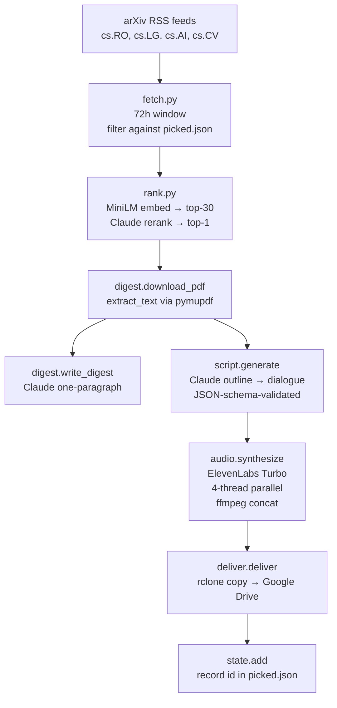

# PaperFatcher

> Every weekday morning at 5:30, an arXiv paper turns into a 10-minute podcast on your phone.

PaperFatcher reads the last 72 hours of arXiv submissions in your chosen
categories, picks the single most relevant paper for your interests, downloads
the PDF, has Claude write a podcast-style dialogue between two co-hosts, and
synthesizes the audio with ElevenLabs. The dated folder is pushed to Google
Drive via rclone so it's waiting on your phone for the morning commute.

It runs unattended via a `systemd` user timer, dedups against past picks so
runners-up stay eligible the next day, and keeps episodes around 10 minutes —
short enough to finish before the coffee gets cold.

## What gets produced

Each weekday under `output/<YYYY-MM-DD>/`:

| File | What |
|---|---|
| `paper.pdf` | The original arXiv PDF |
| `digest.md` | One-paragraph summary (Claude) plus the abstract, for offline reading |
| `outline.md` | Claude's structured "cheat sheet" of the paper — useful as a tighter alternative to reading the PDF |
| `script.json` | The two-host dialogue, structured as `{dialogue: [{speaker: "A"|"B", text: ...}, ...]}` |
| `digest.mp3` | The episode itself, ~10 min, 128 kbps stereo, ~4 MB |

Same files land in your Google Drive at `<rclone-remote>:PaperFatcher/<YYYY-MM-DD>/`.

## Architecture



The pipeline is one Python entry point — `paperfatcher.pipeline:main` — that
runs each stage sequentially and short-circuits on `--dry-run`, `--no-audio`,
or `--no-deliver` flags.

## Quick install (Ubuntu / Debian)

```bash
wget -qO- https://raw.githubusercontent.com/LucaFrat/PaperFetcher/main/install.sh | bash
```

The installer:

1. Installs system packages (`ffmpeg`, `rclone`, `jq`, `gum`) via apt
2. Installs `uv` (Python package manager)
3. Verifies the Claude Code CLI is present
4. Clones the repo to `~/.local/share/paperfetcher`
5. Runs `uv sync` to set up the Python env
6. Launches an interactive wizard that asks for:
   - Episode length (5-15 min)
   - TTS engine — **Edge TTS** (free, no setup) or **ElevenLabs** (paid, higher quality)
   - Voices for the two co-hosts
   - arXiv categories + your research interests (opens your `$EDITOR`)
   - Schedule (weekdays-only or daily, time of day)
   - rclone Google Drive remote (launches `rclone config` if not set up yet)
7. Generates `config/settings.toml`, the systemd unit files, and (if ElevenLabs) `~/.config/environment.d/paperfetcher.conf` for the API key
8. Enables the systemd timer, offers `loginctl enable-linger`, and runs an optional dry-run to verify

End-to-end takes about **10 minutes**, mostly spent on rclone's browser auth.

### Prerequisites the installer does NOT handle

Set these up before running the installer:

- **[Claude Code CLI](https://code.claude.com/docs)** — install + `claude login` (pick a Max-plan account)
- **A Google account** for rclone (browser auth happens inside the wizard)
- *(Only if you choose ElevenLabs)* an [ElevenLabs](https://elevenlabs.io) Creator subscription and an API key with `text_to_speech_write` + `user_read` permissions

### Manual install

If you'd rather skip the wizard (e.g. you're contributing to the project, running on a non-apt distro, or you don't want `gum` installed), see the [Manual install](#manual-install) appendix at the bottom.

### Uninstall

Removes the install directory, systemd units, and the API-key env file. Does not touch apt packages, your rclone config, or your Google Drive content.

```bash
wget -qO- https://raw.githubusercontent.com/LucaFrat/PaperFetcher/main/uninstall.sh | bash
```

Or, if you've already cloned: `bash ~/.local/share/paperfetcher/uninstall.sh`. Pass `--yes` to skip the confirmation prompt.

## Configuration

### `config/interests.md`

Markdown with a frontmatter `categories:` line listing arXiv category codes,
followed by a free-form description of what you care about:

```markdown
---
categories: cs.RO, cs.LG, cs.AI, cs.CV
---

# Research interests

Primary focus: robot learning — methods that combine machine learning with
robotics... (etc.)
```

The body is fed to the embedding model (for shortlisting) and to Claude (for
the rerank). Be specific — "I love sim-to-real for dexterous manipulation" gives
better picks than "ML for robots."

### `config/settings.toml`

```toml
[fetch]
window_hours          = 72        # how far back to look in RSS
request_delay_seconds = 5         # politeness delay between RSS feed fetches

[rank]
shortlist_size  = 30              # MiniLM cosine-top-N before Claude rerank
embedding_model = "sentence-transformers/all-MiniLM-L6-v2"

[audio]
voice_a = "<elevenlabs voice id for host A>"
voice_b = "<elevenlabs voice id for host B>"
elevenlabs_model         = "eleven_turbo_v2_5"   # or eleven_multilingual_v2 (2× cost)
elevenlabs_output_format = "mp3_44100_128"

[deliver]
rclone_remote  = "<remote-name>:PaperFatcher"
local_fallback = "~/PaperFatcher-output"

[paths]
output_dir = "output"
state_file = "state/picked.json"
logs_dir   = "logs"
interests  = "config/interests.md"
```

## Running

### Manual

```bash
bash run.sh                # full pipeline
bash run.sh --dry-run      # fetch + rank only, picks paper but skips download/digest/audio/deliver
bash run.sh --no-audio     # everything except TTS synthesis
bash run.sh --no-deliver   # everything except rclone push (local-only)
```

`--dry-run`, `--no-audio`, and `--no-deliver` skip recording the pick to
`picked.json`, so they're safe for testing without consuming a paper.

### Scheduled

The systemd timer fires every Mon–Fri at 05:30 local time. Force a run for
testing:

```bash
systemctl --user start paperfatcher.service
journalctl --user -u paperfatcher.service -n 100 --no-pager
```

## Operations

### Logs

| Where | What |
|---|---|
| `logs/pipeline.log` | Cumulative pipeline log across all runs (Python-side) |
| `logs/systemd.out.log` | systemd-captured stdout from cron runs |
| `logs/systemd.err.log` | systemd-captured stderr (tracebacks land here) |
| `journalctl --user -u paperfatcher.service` | systemd journal for the service |
| `systemctl --user list-timers paperfatcher.timer` | When the next firing is |

### Cost monitoring

Each pipeline run logs three Claude calls and one ElevenLabs synth:

```
claude rerank: $0.32 equiv | 60000ms | 2 turns
claude digest: $0.18 equiv | 23000ms | 1 turn
claude outline: $0.31 equiv | 98000ms | 1 turn
claude script: $0.45 equiv | 84000ms | 2 turns
elevenlabs synth: 54 lines, 11221 input chars (model=eleven_turbo_v2_5)
```

- **Claude `equiv` cost is informational only** on Max plan — `apiKeySource` is `none`, no per-call billing. The numbers represent what API-tier billing would have charged.
- **ElevenLabs input chars** × **0.5** (Turbo discount) = credits actually consumed against your monthly allotment.

Quick subscription check:

```bash
uv run python -c "
from elevenlabs.client import ElevenLabs
import os
sub = ElevenLabs(api_key=os.environ['ELEVENLABS_API_KEY']).user.subscription.get()
print(f'{sub.tier} | {sub.character_count}/{sub.character_limit} used | resets unix={sub.next_character_count_reset_unix}')
"
```

### Cost ceiling

Targeting 10-min episodes Mon–Fri:

| Component | Cost |
|---|---|
| Claude (Max plan) | $0 — already paying for the subscription |
| ElevenLabs Creator | $22/mo flat (~94k credits used out of 100k+) |
| Google Drive | free (rclone is the client) |
| **Total** | **$22/mo + your existing Claude Max** |

## Troubleshooting

### The cron didn't fire

```bash
systemctl --user list-timers paperfatcher.timer
loginctl show-user "$USER" | grep -i linger    # should be "yes"
```

If `Linger=no`, run `sudo loginctl enable-linger "$USER"` — without it, user
systemd units pause when you're logged out.

### `ffmpeg: error while loading shared libraries: libx264.so.138`

A conda environment installed an `ffmpeg` ahead of `/usr/bin/ffmpeg` on your
PATH. The conda binary was built against `libx264.so.138`, which doesn't exist
on Ubuntu 24.04 (you have `.164`). The pipeline pins to `/usr/bin/ffmpeg`
explicitly to avoid this — if it ever recurs, check `audio.py:_system_ffmpeg`.

### `ELEVENLABS_API_KEY not set` at the start of a cron run

```bash
systemctl --user show-environment | grep ELEVENLABS
ls -la ~/.config/environment.d/paperfatcher.conf  # mode should be -rw-------
```

If missing, repeat the `printf` + `systemctl --user import-environment` step
from setup.

### arXiv RSS returns 0 papers

- **On weekends:** expected. arXiv only posts new submissions Mon–Fri. The
  weekday timer skips Sat/Sun for this reason.
- **On weekdays:** check the RSS endpoint manually:
  ```bash
  curl -sI https://export.arxiv.org/rss/cs.RO | head
  ```
  arXiv occasionally rate-limits IPs (HTTP 503). Wait an hour.

### ElevenLabs `quota_exceeded`

Two possible causes:
1. **Per-API-key cap** — set in the dashboard when you created the key. Set to
   "Unlimited" or large.
2. **Monthly allotment** — Creator gives ~100k credits/mo. Check via the
   subscription endpoint above. If exhausted, either wait for the reset date
   or upgrade to Pro.

### Claude `total_cost_usd` is non-zero — am I being billed?

No, if `apiKeySource: "none"` is in the init event. The cost field reports
*equivalent* API pricing for transparency; on Max plan, only your $200/mo
subscription matters.

### A pipeline run failed mid-way; how do I salvage it?

If `script.json` already exists in the day's folder, you can re-run just the
audio + delivery without re-paying for Claude:

```bash
set -a; . ~/.config/environment.d/paperfatcher.conf; set +a
uv run python -c "
from pathlib import Path
from paperfatcher.config import load_settings
from paperfatcher import audio, deliver, state as state_mod
s = load_settings()
day = Path(s.paths.output_dir) / 'YYYY-MM-DD'
audio.synthesize(day / 'script.json', day, audio_cfg=s.audio)
deliver.deliver(day, rclone_remote=s.deliver.rclone_remote,
                local_fallback=s.deliver.local_fallback)
state_mod.add(s.paths.state_file, '<paper-id>')
"
```

## Project structure

```
PaperFatcher/
├── README.md
├── pyproject.toml              # uv-managed, Python 3.11–3.12
├── run.sh                      # entry point: `uv run python -m paperfatcher.pipeline`
├── config/
│   ├── interests.md            # categories + free-form interests
│   └── settings.toml           # all knobs
├── src/paperfatcher/
│   ├── __init__.py
│   ├── claude_cli.py           # subprocess wrapper around `claude -p`,
│   │                           # text + JSON-schema modes, cost logging
│   ├── fetch.py                # arXiv RSS feeds, 72h window, picked.json filter
│   ├── rank.py                 # MiniLM shortlist → Claude rerank → 1 paper
│   ├── digest.py               # PDF download, pymupdf text extract, digest.md
│   ├── script.py               # two-stage: outline → JSON-schema dialogue
│   ├── audio.py                # ElevenLabs Turbo (4-thread) + ffmpeg concat
│   ├── deliver.py              # rclone copy → Google Drive (local fallback)
│   ├── state.py                # picked.json with atomic writes
│   ├── config.py               # tomllib loader + frozen dataclasses
│   └── pipeline.py             # orchestrator + CLI flags + logging setup
├── systemd/
│   ├── paperfatcher.service    # ExecStart=run.sh, oneshot
│   └── paperfatcher.timer      # OnCalendar=Mon..Fri *-*-* 05:30:00
├── state/
│   └── picked.json             # {"ids": [...], "updated_at": ...}
├── output/                     # daily artifacts (gitignored)
└── logs/                       # pipeline + systemd logs (gitignored)
```

## Design choices worth knowing

- **Why RSS instead of arXiv's API?** The API rate-limits aggressively (HTTP
  503 per-IP); RSS is unauthenticated, fast, and contains everything we need.
- **Why two-stage script generation?** The outline pass forces Claude to
  ground itself in specific paper details before writing dialogue. The
  dialogue pass riffs on the outline. Single-stage produced more generic prose.
- **Why `eleven_turbo_v2_5` over `eleven_multilingual_v2`?** Half the credit
  cost, near-identical quality for technical English. Fits the 100k Creator
  budget for daily 10-min episodes.
- **Why threaded synthesis?** ElevenLabs requests are I/O-bound; 4 workers
  cuts a 58-line synth from ~30s to ~9s with no quality difference.
- **Why pin `/usr/bin/ffmpeg`?** Conda's bundled `ffmpeg` shadowed the system
  binary in cron's PATH and crashed on a missing libx264 — a classic "works
  in interactive, dies in cron" trap.

## Manual install

The wizard is a convenience layer over these steps. If you don't want `gum`
or you're on a non-apt distro, do them by hand.

### 1. System packages

```bash
sudo apt update
sudo apt install -y ffmpeg rclone jq libnotify-bin git curl
```

### 2. uv

```bash
curl -LsSf https://astral.sh/uv/install.sh | sh
source $HOME/.local/bin/env
```

### 3. Claude Code CLI

Install per the [official docs](https://code.claude.com/docs), then `claude
login` and pick a Max-plan account. Verify with:

```bash
claude -p "say hi" --output-format json | jq -r '.[] | select(.type=="result") | .total_cost_usd'
```

If `apiKeySource` in the init event is `"none"`, you're on Max-plan billing
(no per-call charges).

### 4. rclone Google Drive remote

```bash
rclone config           # interactive: name=gdrive, type=drive, scope=drive, browser-auth
rclone lsd <remote>:    # smoke test
rclone mkdir <remote>:PaperFetcher
```

### 5. ElevenLabs API key (only if you want ElevenLabs)

In the [ElevenLabs dashboard](https://elevenlabs.io):

1. Subscribe to **Creator** ($22/mo, 100k+ credits/mo).
2. Create an API key with permissions: **Text-to-Speech: Convert** and **User: Read**.
3. Set the per-key credit limit to **Unlimited** (or at least 10k).

Persist the key for both interactive shells and the systemd cron:

```bash
umask 077
printf 'ELEVENLABS_API_KEY=%s\n' "$ELEVENLABS_API_KEY" \
  > ~/.config/environment.d/paperfetcher.conf
systemctl --user import-environment ELEVENLABS_API_KEY
```

If you'd rather use the free Edge TTS backend, skip this step entirely and
set `[audio] backend = "edge_tts"` in `config/settings.toml`.

### 6. Clone + install

```bash
git clone https://github.com/LucaFrat/PaperFetcher.git ~/.local/share/paperfetcher
cd ~/.local/share/paperfetcher
uv sync
```

### 7. Configuration

Edit `config/settings.toml` and `config/interests.md` with your choices. Both
files are documented in [Configuration](#configuration) above.

### 8. systemd timer

```bash
mkdir -p ~/.config/systemd/user
# Edit the unit files first to match your install path:
sed "s|%REPO_PATH%|$HOME/.local/share/paperfetcher|g" \
    installer/templates/paperfetcher.service.tmpl > ~/.config/systemd/user/paperfetcher.service
sed "s|%ONCALENDAR%|Mon..Fri *-*-* 05:30:00|" \
    installer/templates/paperfetcher.timer.tmpl > ~/.config/systemd/user/paperfetcher.timer
systemctl --user daemon-reload
systemctl --user enable --now paperfetcher.timer
sudo loginctl enable-linger "$USER"   # so it fires while you're logged out
systemctl --user list-timers paperfetcher.timer
```

## License

Personal project — no license set. If you fork, add one.
